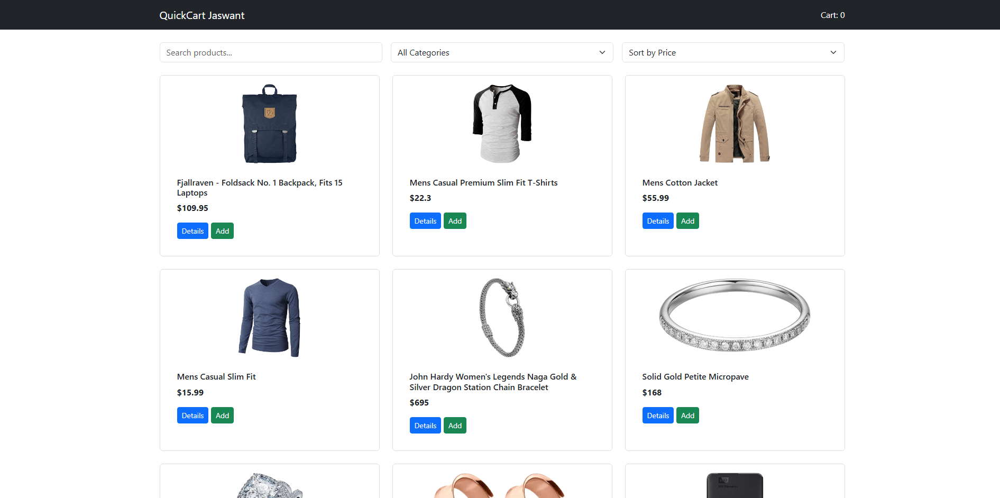

## Frontend Assessment 
- Based on HTML, JavaScript, BootStrap
- NO React Used
- API : https://fakestoreapi.com

## Problem Statement (Fictitious Scenario)
**An e-commerce startup “QuickCart” wants to build a Product Listing Dashboard for internal use.**
The dashboard should:
-- Fetch products from an external API
-- Display them in a clean UI
-- Allow filtering, searching, and basic interaction
-- Prepare the foundation for future React migration

 ## Features Implemented:
 -- Fetch and Display Products
 -- Category Filter
 -- Search Functionality
 -- Product Detail View
 -- Sorting Feature
 -- Add to cart (Only Shows NO. of items added in the cart, No seperate cart page)
 -- Error Handling
 -- Reusable Functions
 -- Responsive UI

 ## Project Structure
quickcart-dashboard/
│
├── index.html
├── style.css
├── script.js
└── README.md

## Screenshots

 live link : https://quickcart-dashboard-one.vercel.app/
